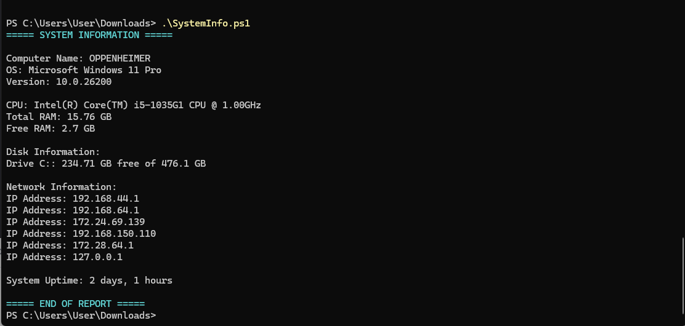

# 🖥️ System Information Script (PowerShell)

## 📌 Overview

This PowerShell script collects and displays essential system information from a Windows machine.
It is designed to help IT support technicians and system administrators quickly assess system health and configuration.

---

## 🎯 Purpose

* Automate system information gathering
* Reduce manual troubleshooting time
* Provide quick insights into machine specifications

---

## ⚙️ Features

This script retrieves:

* 🧠 CPU information
* 💾 RAM usage and total memory
* 🗄️ Disk space usage
* 🖥️ Operating System details
* 🌐 Network configuration
* ⚡ System uptime
* 📄 Optional JSON report export

---

## 🧪 Technologies Used

* PowerShell
* CIM (Common Information Model)

---

## 🚀 How to Run

### Requirements

- Windows 10, Windows 11, or Windows Server
- Windows PowerShell 5.1 or PowerShell 7
- Permission to query local system information

1. Open PowerShell
2. Navigate to the script directory:

   ```powershell
   cd path\to\your\script
   ```
3. Run the script:

   ```powershell
   .\SystemInfo.ps1
   ```

### Export results to JSON

Use `-ExportPath` to save the collected system information to a JSON file:

```powershell
.\SystemInfo.ps1 -ExportPath .\SystemInfo.json
```

---

## 📸 Example Output

<picture>
  <source media="(prefers-color-scheme: dark)" srcset="doc/System-info.png">
  <source media="(prefers-color-scheme: light)" srcset="doc/System-info.png">
  
</picture>

---

## 🧠 Concepts Demonstrated

* Variables
* Command usage
* System queries using `Get-CimInstance`
* Output formatting
* Parameters and JSON export

---

## 🔐 Use Case

This script can be used in:

* IT Support troubleshooting
* System audits
* Pre-deployment checks
* Helpdesk diagnostics

---

## 📈 Future Improvements

* Add remote computer support
* Include GPU information
* Build a GUI version

---

## ✅ Quality checks

Every push and pull request to `main` runs PSScriptAnalyzer through GitHub Actions. This catches common PowerShell quality problems before changes are merged.

## 🤝 Contributing

Issues and pull requests are welcome. Create a focused branch, explain the reason for your change, and describe how you tested it. Please do not include exported system reports because they may contain device or network information.

## 📄 License

Licensed under the [MIT License](LICENSE).

---
