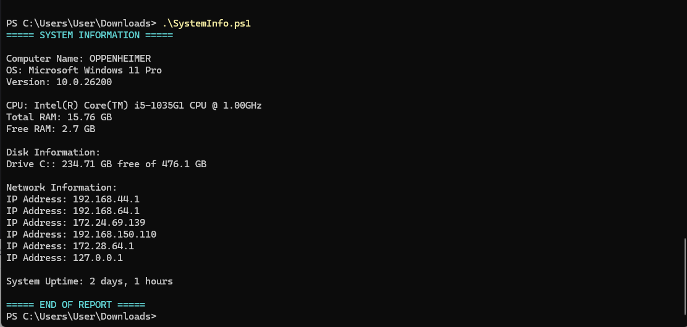

# Windows System Information

[](https://github.com/gladkhumalo/System-Info-Script/actions/workflows/powershell-quality.yml)
[](https://github.com/gladkhumalo/System-Info-Script/releases)
[](LICENSE)

A tested PowerShell tool that collects essential information from a local Windows computer, displays a readable summary, and optionally exports structured JSON.

## Features

- Operating-system name and version
- Processor information
- Total and available memory
- Fixed-disk capacity and free space
- Active IPv4 addresses, excluding loopback and APIPA addresses
- System uptime
- Structured pipeline output
- Optional JSON export
- Automated analysis and Pester tests on PowerShell 7 and Windows PowerShell 5.1

## Requirements

- Windows 10, Windows 11, or Windows Server
- Windows PowerShell 5.1 or PowerShell 7
- Permission to query local system information

## Quick start

Clone the repository and enter its directory:

```powershell
git clone https://github.com/gladkhumalo/System-Info-Script.git
Set-Location System-Info-Script
```

Display the local system summary:

```powershell
.\SystemInfo.ps1
```

Export the report to JSON:

```powershell
.\SystemInfo.ps1 -ExportPath .\SystemInfo.json
```

Return a reusable PowerShell object:

```powershell
$report = .\SystemInfo.ps1 -PassThru
$report.Disks | Sort-Object FreeGB
```

## Use the module directly

```powershell
Import-Module .\src\SystemInfo.psd1

$report = Get-SystemInfo
$report | Export-SystemInfoReport -Path .\SystemInfo.json
```

`Get-SystemInfo` returns objects instead of preformatted text, so its results can be filtered, sorted, exported, tested, or passed into other automation.

## Example output

<picture>
  <source media="(prefers-color-scheme: dark)" srcset="doc/System-info.png">
  <source media="(prefers-color-scheme: light)" srcset="doc/System-info.png">
  
</picture>

## Project structure

```text
.
├── .github/                  # Actions workflow and contribution templates
├── doc/                      # Documentation images
├── src/
│   ├── SystemInfo.psd1       # Module manifest and version
│   └── SystemInfo.psm1       # Reusable commands
├── tests/
│   └── SystemInfo.Tests.ps1  # Pester unit tests
├── SystemInfo.ps1            # Friendly command-line entry point
├── CHANGELOG.md
├── LICENSE
└── SECURITY.md
```

## Testing locally

Install the development tools once:

```powershell
Install-Module Pester -MinimumVersion 5.5.0 -Scope CurrentUser
Install-Module PSScriptAnalyzer -Scope CurrentUser
```

Run the tests and static analysis:

```powershell
Invoke-Pester -Path .\tests -Output Detailed
Get-ChildItem -Path . -Recurse -File |
    Where-Object Extension -in '.ps1', '.psm1', '.psd1' |
    Invoke-ScriptAnalyzer
```

GitHub Actions runs equivalent checks for every pull request and every push to `main`.

## Security and privacy

Generated reports can contain computer names, IP addresses, operating-system details, and storage information. Review and redact reports before sharing them. Do not attach unredacted reports to public issues.

See [SECURITY.md](SECURITY.md) for vulnerability-reporting guidance.

## Roadmap

- Optional remote-computer support
- GPU information
- HTML report export
- Additional integration tests on Windows Server

## Contributing

Issues and pull requests are welcome. Create one focused branch, explain why the change is needed, and describe how you tested it. The pull-request template contains the full checklist.

## License

Licensed under the [MIT License](LICENSE).
